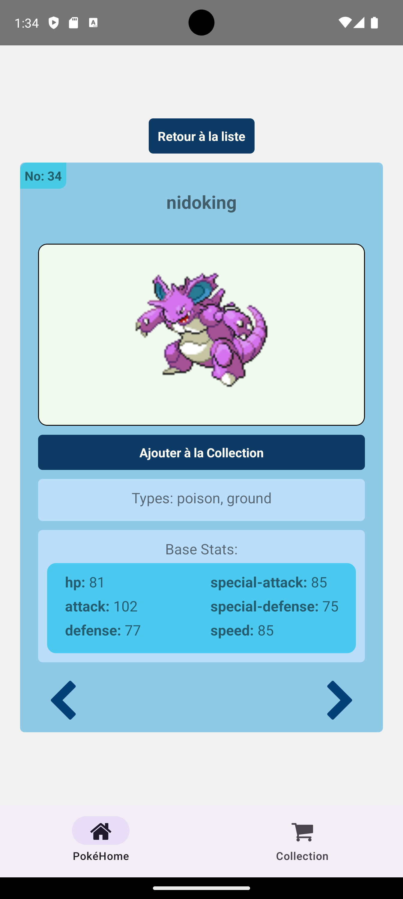

# Pokémon Collection App

Cette application vous permet de gérer votre collection de Pokémon. Vous pouvez consulter la liste des Pokémon disponibles, ajouter des Pokémon à votre collection, les supprimer et même afficher les détails de chaque Pokémon.

## Fonctionnalités

- Affichage de la liste des Pokémon disponibles
- système de navigation (Tab et Stack)
- Filtrage des Pokémon par nom, ID et type
- Ajout de Pokémon à votre collection
- Suppression de Pokémon de votre collection
- Affichage des détails de chaque Pokémon (depuis la collection aussi)
- Possibilité de naviguer d'une fiche pokémon à l'autre
- DarkMode (en cours possibilité de l'améliorer avec Appearance de React Native)
- Persistance des données en cache (en cours utilisation de redux-persist et AsyncStorage) retirée soucis d'implémentation
- Amélioration possible:
- Utilisation d'un composant CustomButton 
- utilisation d'un composant pour éviter les occurences pour l'affichage des pokemons
- Utilisation de requete API avec plus de précisions

## Technologies utilisées

- React Native
- Redux Toolkit
- React Navigation
- Async Storage
- react-native-appearance(en cours)
- Redux Persist(en cours)

## Installation

1. Clonez ce dépôt sur votre machine locale :
2. Lancer l'émulateur depuis Android studio (utilisation du Pixel 8 Pro Api 34 avec Android 14.0 |x86_64)
3. Modifie le fichier build.gradle dans /android/app et ajouter ligne 4:
   {apply from: "../../node_modules/react-native-vector-icons/fonts.gradle}
5. Lancer l'installation des dépendances avec npm i
4. Lancer le build de l'application avec npx react-native run-android dans la racine du projet

## Capture d'écran de l'Application

 

*Capture d'écran de la page d'accueil de l'application, montrant une liste de pokemon filtrable par nom, id et type, utilisation du darkmode possible.*

 

*Capture d'écran de la page de l'écran de la collection de pokemon avec possibilité de suppression totale ou individuelle et navigation vers les détails.*

  

*Capture d'écran de la page de détail du pokemon avec possibilité de d'ajout du pokemon à la collection et possibilté de naviguer vers la fiche pokemon suivante ou précédente.*

*Aperçu de la maquette avec les écrans principaux*
